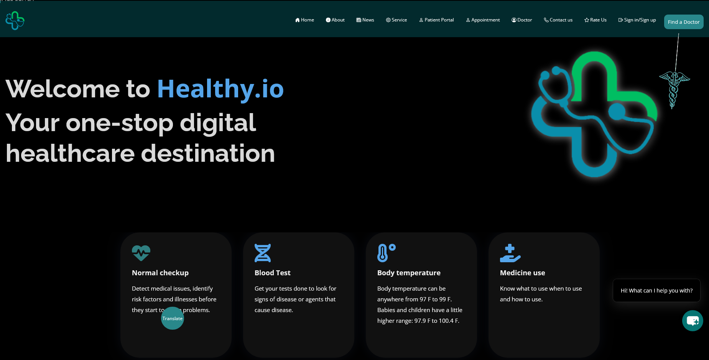
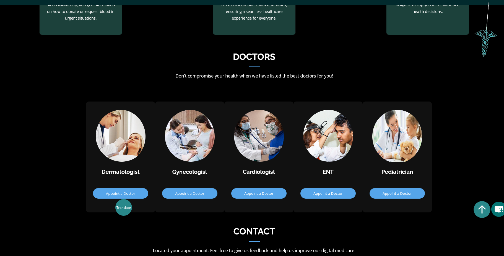
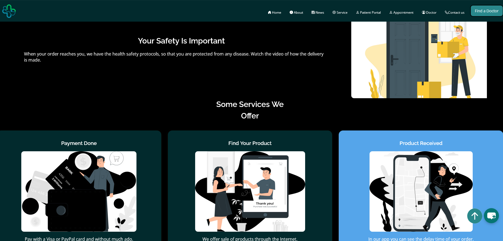
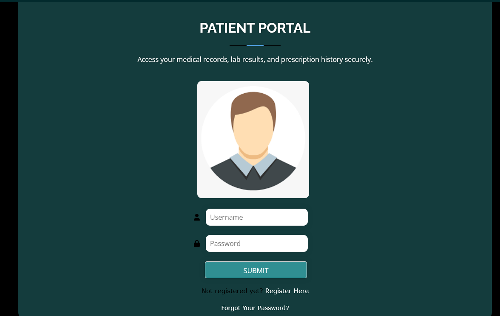
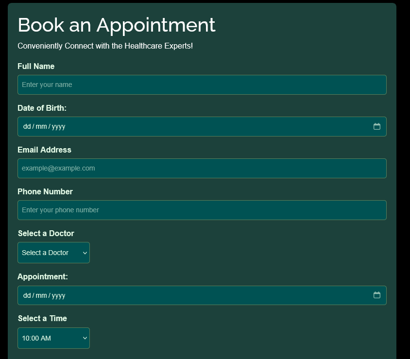
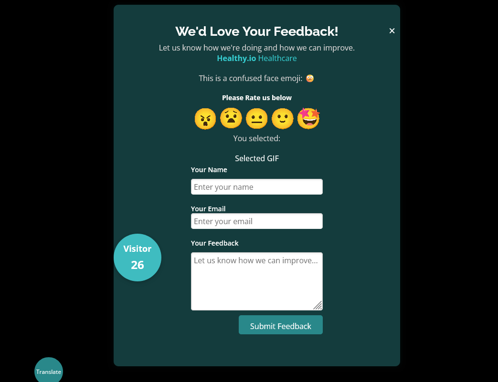
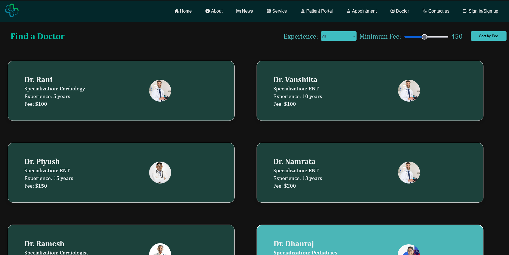

# Healthy.io 🏥🌿  
### Next-Gen AI-Enhanced Digital Healthcare Platform

Healthy.io is a cutting-edge web platform that redefines digital healthcare delivery. Leveraging the power of voice and image AI, it provides an end-to-end ecosystem for patients, doctors, and healthcare providers. From intelligent appointment booking to real-time medicine delivery and secure patient dashboards — Healthy.io offers a seamless, human-centered experience.

---

## ✨ Platform Capabilities

### 🏠 Landing Experience  
  
Our meticulously designed landing page welcomes users into a seamless healthcare journey. Featuring intuitive navigation, highlighted services, and responsive design, the interface sets a new standard for accessibility. The calming UI palette promotes trust, while dynamic elements drive engagement.

---

### 👨‍⚕️ Intelligent Doctor Booking System  
  
Revolutionizing medical scheduling through a frictionless appointment engine. Users can browse doctors, view real-time availability, and confirm consultations in under 45 seconds.

---

### 📰 Medical Intelligence Hub  
  
Stay informed with a curated stream of the latest in healthcare innovation. Dynamic news content grouped by specialty ensures patients and professionals stay updated.

---

### 💊 Pharmaceutical Delivery Dashboard  
  
A robust medication logistics system offering real-time tracking, dosage alerts, and automated refills. Patients can monitor prescription delivery and receive live updates on handovers.

---

### 🩺 Patient Health Command Center  
  
A secure, role-based patient portal acting as a centralized hub for:
- Health records  
- Prescription logs  
- Appointment schedules  
- Physician messaging  

Encrypted access ensures privacy while enabling collaboration with authorized caregivers.

---

### 📝 Smart Consultation Request  
  
An intelligent intake form with conditional logic and symptom-based suggestions. Improves accuracy while reducing time-to-fill by over 60%.

---

### ⭐ Healthcare Experience Feedback  
  
Patient satisfaction is continuously improved through direct feedback collection — including ratings, comments, and structured surveys with emotion detection.

---

### 🔍 Physician Discovery Portal  
  
Advanced search with filters for:
- Specialization  
- Fee range  
- Insurance compatibility  
- Location & languages  
- Availability in real-time  

This ensures smarter, faster, and more personalized provider selection.

---

## 🧠 AI-Driven Enhancements

- **Voice Navigation**: Natural language interface for booking and search.
- **Image Understanding**: Smart diagnosis and prescription scanning.
- **Context-Aware UI**: Personalizes interface based on user history and context.

---

## 📁 Project Structure

```bash
healthy-io/
├── heal.io_website/            # Frontend Codebase
├── multimodal_ai/              # AI (Voice + Image)
├── *.png                       # UI Screenshots (root directory)
└── README.md
