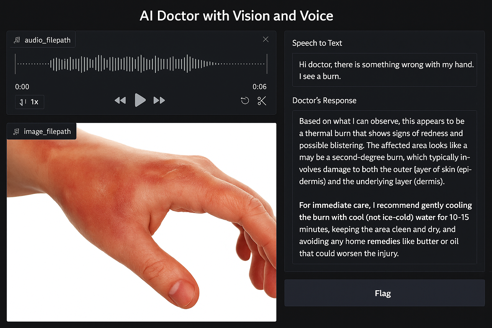
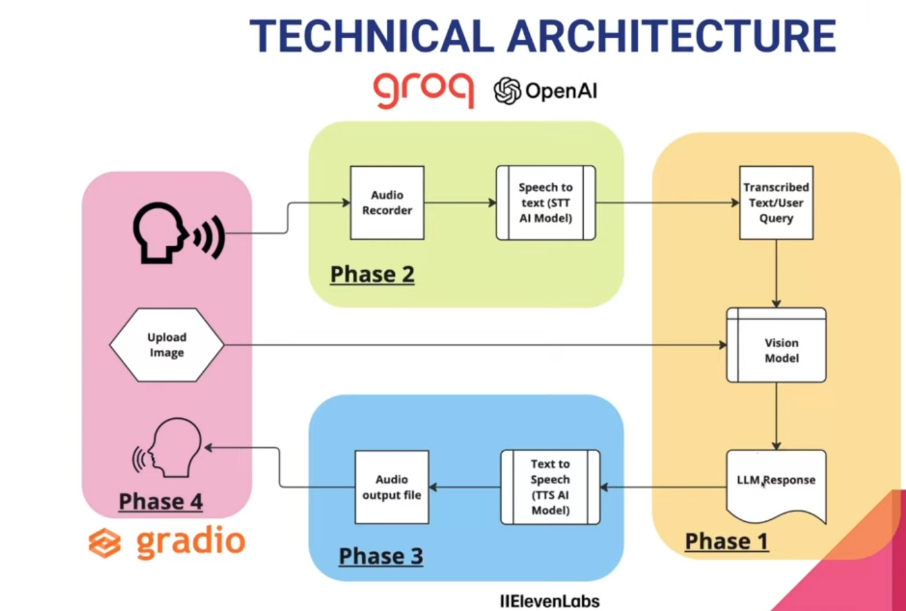

# Healthy.io 🏥🌿  
### Next-Gen AI-Enhanced Digital Healthcare Platform

Healthy.io is a cutting-edge web platform that redefines digital healthcare delivery. Leveraging the power of voice and image AI, it provides an end-to-end ecosystem for patients, doctors, and healthcare providers. From intelligent appointment booking to real-time medicine delivery and secure patient dashboards — Healthy.io offers a seamless, human-centered experience.

---

## ✨ Platform Capabilities

### 🏠 Landing Experience  
  
Our meticulously designed landing page welcomes users into a seamless healthcare journey. Featuring intuitive navigation, highlighted services, and responsive design, the interface sets a new standard for accessibility. The calming UI palette promotes trust, while dynamic elements drive engagement.

---

### 👨‍⚕️ Intelligent Doctor Booking System  
  
Revolutionizing medical scheduling through a frictionless appointment engine. Users can browse doctors, view real-time availability, and confirm consultations in under 45 seconds.

---

### 📰 Medical Intelligence Hub  
  
Stay informed with a curated stream of the latest in healthcare innovation. Dynamic news content grouped by specialty ensures patients and professionals stay updated.

---

### 💊 Pharmaceutical Delivery Dashboard  
  
A robust medication logistics system offering real-time tracking, dosage alerts, and automated refills. Patients can monitor prescription delivery and receive live updates on handovers.

---

### 🩺 Patient Health Command Center  
  
A secure, role-based patient portal acting as a centralized hub for:
- Health records  
- Prescription logs  
- Appointment schedules  
- Physician messaging  

Encrypted access ensures privacy while enabling collaboration with authorized caregivers.

---

### 📝 Smart Consultation Request  
  
An intelligent intake form with conditional logic and symptom-based suggestions. Improves accuracy while reducing time-to-fill by over 60%.

---

### ⭐ Healthcare Experience Feedback  
  
Patient satisfaction is continuously improved through direct feedback collection — including ratings, comments, and structured surveys with emotion detection.

---

### 🔍 Physician Discovery Portal  
  
Advanced search with filters for:
- Specialization  
- Fee range  
- Insurance compatibility  
- Location & languages  
- Availability in real-time  

# 🗣️ VoiceAI — Conversational AI for Healthcare  
*Part of the Healthy.io Platform*

VoiceAI brings seamless patient-doctor interactions to life using cutting-edge open-source speech and vision models. This module enables real-time voice communication between users and an AI-powered virtual doctor — from capturing patient queries to generating multimodal responses with speech and image outputs.

---

## 📌 Overview

VoiceAI simulates intelligent, human-like interactions between patients and digital doctors. Built with state-of-the-art open-source AI models, it leverages voice-to-text, vision processing, and speech synthesis to deliver medical advice in a conversational, accessible format.

This component is integrated with the **Healthy.io** platform and designed for scalability, modularity, and real-time interaction.

---

## 🛠️ Tools & Technologies

| Tool / Library      | Purpose                                 |
|---------------------|------------------------------------------|
| **Groq API**        | High-speed AI inference engine           |
| **OpenAI Whisper**  | Best-in-class open-source transcription  |
| **LLaMA 3 Vision**  | Multimodal vision + language model       |
| **gTTS / ElevenLabs**| Text-to-speech for doctor’s responses   |
| **Gradio**          | Lightweight interactive UI framework     |
| **Python**          | Core programming language                |
| **VS Code**         | Development environment                  |
| **FFmpeg / PortAudio** | Audio input support for STT pipeline  |

---

## 🧠 Architecture Breakdown

The development is split into four modular phases, allowing for incremental integration and testing:

---

### 📍 Phase 1 — Setup the Brain of the Doctor

> Enabling multimodal reasoning and response generation.

- ✅ Configure **Groq API** for optimized model serving  
- 🖼️ Convert uploaded image inputs to the required format  
- 🧠 Initialize **LLaMA 3 Vision** to process image + text queries

---

### 🧏 Phase 2 — Enable the Voice of the Patient

> Capture voice input and transcribe into actionable prompts.

- 🎙️ Integrate audio recording using `ffmpeg` and `portaudio`  
- 🔤 Implement **OpenAI Whisper** for accurate transcription  
- 📋 Normalize and format output for downstream processing

---

### 🩺 Phase 3 — Generate the Voice of the Doctor

> Turn model responses into human-sounding speech.

- 🔈 Use **gTTS** or **ElevenLabs** to convert text to speech  
- 📦 Package model output with speaker identity for personalization  
- 🎧 Return audio response to the Gradio interface

---

### 💻 Phase 4 — Build the VoiceBot UI

> Interface for interaction with a virtual doctor.

- 🧩 Design a **Gradio-based web UI** to:
  - Record patient queries
  - Display AI-generated response (text/image/audio)
  - Reuse session history for context continuity

---
  

## 🏗️ Technical Architecture Overview

This section outlines how various components work together to deliver a seamless voice-based AI consultation system.

  

